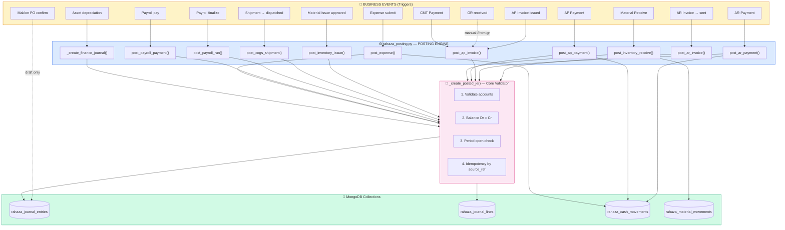
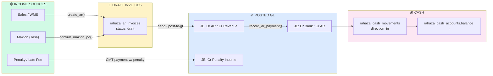
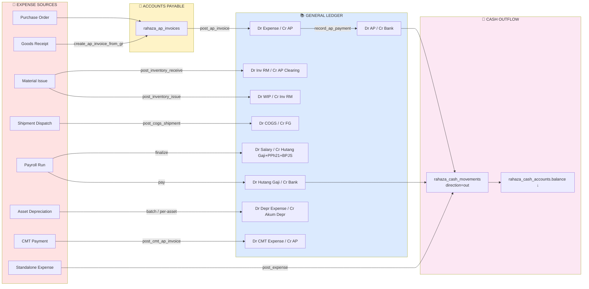
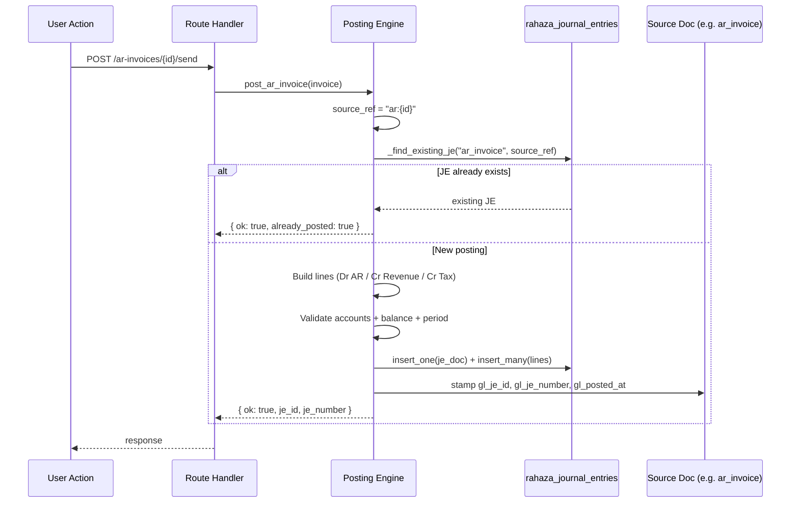

# 🔄 Mapping Otomatisasi Pemasukan & Pengeluaran Sistem ERP

> **Tujuan:** Memberikan SSOT (Single Source of Truth) untuk semua alur finansial yang dieksekusi **otomatis oleh sistem** — bukan input manual.
> **Tanggal Analisis:** 2025
> **Cakupan:** Backend routes `/app/backend/routes/*`
> **Engine Utama:** `routes/rahaza_posting.py` (754 baris, 11 fungsi posting otomatis)

---

## 📋 Ringkasan Eksekutif

Sistem ERP ini memiliki **satu engine posting pusat** (`rahaza_posting.py`) yang menulis ke:
- `rahaza_journal_entries` (header jurnal — JE)
- `rahaza_journal_lines` (mirror baris jurnal untuk GL/Trial Balance cepat)
- `rahaza_cash_movements` (kas masuk/keluar)

Semua otomasi **idempoten** via `(source_module, source_ref)` — re-trigger tidak menghasilkan duplikat. Setiap JE divalidasi: periode terbuka, debet = kredit, akun ada & non-header (`is_group=false`).

**Skor Otomatisasi:**
- ✅ **14 alur otomatis pengeluaran** (Expense)
- ✅ **6 alur otomatis pemasukan** (Income / AR)
- ⚠️ **3 gap teridentifikasi** (collection terpisah belum integrasi GL)

---

## 💰 PEMASUKAN OTOMATIS (Auto-Income / Revenue)

| # | Trigger / Event | File Source | Fungsi | Jurnal (Debit / Credit) | Collection Target |
|---|----------------|-------------|--------|------------------------|-------------------|
| **I1** | AR Invoice → status `sent` | `rahaza_finance.py:216` (`send_ar_invoice`) | `post_ar_invoice()` | **Dr** 1-1301 Piutang Usaha (Total) / **Cr** 4-1100 Pendapatan (Subtotal) / **Cr** 2-1400 PPN Keluaran (Tax) | `rahaza_journal_entries` |
| **I2** | AR Payment direkam | `rahaza_finance.py:253` (`record_ar_payment`) | `post_ar_payment()` | **Dr** 1-1201 Bank (Cash) / **Cr** 1-1301 Piutang Usaha | `rahaza_journal_entries` + `rahaza_cash_movements` (in) |
| **I3** | Maklon PO `confirm` → Auto-create AR Invoice + Work Orders | `dewi_maklon_pos.py:343` (`confirm_maklon_po`) | Direct insert (draft) | Belum posting JE (status=draft) | `rahaza_ar_invoices` + `rahaza_work_orders` |
| **I4** | Maklon AR Invoice → posting GL | `dewi_maklon_finance.py:209` (`post_ar_for_po`) | `post_maklon_ar_invoice()` | **Dr** 1-1301 AR / **Cr** 4-1100 Pendapatan Jasa Maklon | `rahaza_journal_entries` |
| **I5** | Maklon Advance Payment | `dewi_maklon_finance.py:237` (`record_advance_payment`) | Update AR + cash mvmt | **Dr** Bank / **Cr** Uang Muka Pelanggan | `rahaza_cash_movements` (in) |
| **I6** | CMT Penalty Income (potongan terlambat vendor) | `dewi_maklon_finance.py:129` (`post_cmt_ap_invoice`) | embedded di AP CMT | **Cr** 4-2000 Penalty Income (auto saat AP CMT punya `total_penalty > 0`) | `rahaza_journal_entries` |

> **Catatan:** Alur Maklon punya dua tahap — confirm PO (draft AR) → posting (final JE). Posting tidak otomatis, butuh action `post-ar`.

---

## 💸 PENGELUARAN OTOMATIS (Auto-Expense)

| # | Trigger / Event | File Source | Fungsi | Jurnal (Debit / Credit) | Collection Target |
|---|----------------|-------------|--------|------------------------|-------------------|
| **E1** | AP Invoice → diterbitkan | `rahaza_finance.py:351` (`create_ap`) | `post_ap_invoice()` | **Dr** 6-xxxx Expense (Subtotal) / **Cr** 2-1100 AP (Total) / **Dr** 1-1500 PPN Masukan (Tax) | `rahaza_journal_entries` |
| **E2** | AP Payment direkam | `rahaza_finance.py:388` (`record_ap_payment`) | `post_ap_payment()` | **Dr** 2-1100 AP / **Cr** 1-1201 Bank | `rahaza_journal_entries` + `rahaza_cash_movements` (out) |
| **E3** | Goods Receipt → Buat AP Invoice (draft) | `rahaza_ap_from_gr.py:154` (`create_ap_invoice_from_gr`) | Direct insert | Insert AP draft + stamp GR.`ap_invoice_id` | `rahaza_ap_invoices` |
| **E4** | Standalone Expense disubmit | `rahaza_finance.py:688` | `post_expense()` | **Dr** Expense / **Cr** Bank/Cash | `rahaza_journal_entries` + `rahaza_cash_movements` (out) |
| **E5** | Material Receive (stock IN) | `rahaza_inventory_stock.py:175` (`material_receive`) | `post_inventory_receive()` | **Dr** 1-1410 Inventory RM / **Cr** 2-1110 AP Clearing | `rahaza_journal_entries` + `rahaza_material_movements` |
| **E6** | Material Issue → WIP | `rahaza_inventory_issues.py:296` (`approve`) | `post_inventory_issue()` | **Dr** 1-1420 WIP / **Cr** 1-1410 Inventory RM | `rahaza_journal_entries` |
| **E7** | Material Adjust (±) | `rahaza_inventory_stock.py:232` + `warehouse.py:778` | `post_inventory_adjust()` | **+:** Dr Inventory / Cr Adjustment Expense<br>**−:** Dr Adjustment Expense / Cr Inventory | `rahaza_journal_entries` |
| **E8** | Shipment status → `dispatched` (COGS) | `fulfillment.py:404` + `rahaza_shipments.py:306` | `post_cogs_shipment()` | **Dr** 5-1100 COGS Material / **Dr** 5-1200 COGS Labor / **Dr** 5-1300 COGS Overhead / **Cr** 1-1430 FG Inventory | `rahaza_journal_entries` |
| **E9** | Payroll Run `finalize` | `rahaza_payroll_runs.py:193` (`finalize_run`) | `post_payroll_run()` | **Dr** 6-1100 Salary Expense (Gross) / **Cr** 2-1200 Hutang Gaji (Net) / **Cr** 2-1500 PPh21 / **Cr** 2-1600 BPJS | `rahaza_journal_entries` |
| **E10** | Payroll Payment (bank disburse) | `rahaza_payroll_runs.py:290` (`pay_payroll_run`) | `post_payroll_payment()` | **Dr** 2-1200 Hutang Gaji / **Cr** 1-1201 Bank | `rahaza_journal_entries` |
| **E11** | Asset Depreciation (per asset) | `asset/depreciation_per.py:13` (`post_depreciation`) | `_create_finance_journal()` | **Dr** 6200 Beban Depresiasi / **Cr** 1590 Akumulasi Depresiasi | `rahaza_journal_entries` + `dewi_asset_depreciation` |
| **E12** | Asset Depreciation **BATCH** semua aset | `asset/depreciation_batch.py:9` (`batch_depreciate/{period}`) | `_create_finance_journal()` | Loop per aset, sama dengan E11 | `rahaza_journal_entries` |
| **E13** | Fixed Asset Depreciation (Rahaza scheduled) | `rahaza_fixed_assets.py:303` (`post_depreciation/{period}`) | `post_journal()` | **Dr** account_id_depr_expense / **Cr** account_id_accum_depr | `rahaza_journal_entries` + `rahaza_depr_schedules` |
| **E14** | CMT Payment → posting AP | `dewi_maklon_finance.py:307` (`post_ap_for_cmt_payment`) | `post_cmt_ap_invoice()` | **Dr** 6-2200 Biaya Jasa CMT / **Cr** 2-1100 AP CMT Vendor (− penalty if any) | `rahaza_journal_entries` |

---

## 🔁 EFEK SEKUNDER OTOMATIS (Cash & Stock Movements)

| # | Pemicu | Efek | Collection |
|---|--------|------|------------|
| **S1** | AR Payment direkam | Cash account balance ↑ | `rahaza_cash_movements` (`direction=in`, `category=ar_payment`) + `rahaza_cash_accounts.balance` |
| **S2** | AP Payment direkam | Cash account balance ↓ | `rahaza_cash_movements` (`direction=out`, `category=ap_payment`) |
| **S3** | Expense direkam | Cash account balance ↓ | `rahaza_cash_movements` |
| **S4** | Material Receive | Stock RM ↑ | `rahaza_material_stock` + `rahaza_material_movements` |
| **S5** | Material Issue approved | Stock RM ↓, WIP ↑ | `rahaza_material_stock` |
| **S6** | Accessories PR `Received` | Stock Acc ↑ (TIDAK auto-JE) | `acc_stock` + `rahaza_material_movements` |
| **S7** | Maklon PO confirm | Buat WO + AR Draft | `rahaza_work_orders` + `rahaza_ar_invoices` |
| **S8** | Goods Receipt (warehouse) | Stock ↑, eligible utk AP draft | `warehouse_receiving` |
| **S9** | Production WIP Event (pass/fail) | Update WO progress | `rahaza_wip_events` |
| **S10** | Asset Depreciation posted | NBV ↓, Accum Depr ↑ | `dewi_assets` / `rahaza_fixed_assets` |

---

## ⚠️ GAP & OBSERVASI PENTING

| # | Gap / Issue | Lokasi | Dampak | Rekomendasi |
|---|-------------|--------|--------|-------------|
| **G1** | **Accessories PR** → status `Received` hanya update stok, **tidak buat AP invoice / JE** | `dewi_accessories_purchase.py:259` | Pembelian aksesori tidak masuk GL → laporan keuangan kurang akurat | Tambah hook `post_ap_invoice()` saat Received atau buat workflow approval → AP |
| **G2** | **Dewi Maklon Billing legacy** (`dewi_maklon_invoices`) terpisah dari `rahaza_journal_entries` | `dewi_maklon_billing.py:272` | Invoice maklon lama tidak masuk GL pusat → duplikasi data | Migrasi ke `rahaza_ar_invoices` atau bridge ke posting engine |
| **G3** | **Asset Disposal gain/loss** dihitung tapi tidak auto-posted JE | `rahaza_fixed_assets.py:355` (`dispose_asset`) | Gain/loss tertulis di field tapi tidak masuk income/expense | Tambah `post_asset_disposal()` di posting engine |
| **G4** | **Online Orders / Pack Batches** tidak auto-create AR | `dewi_online_orders.py` | Online sales tidak ter-trigger AR otomatis | Tambah hook pada `pack-batches/{batch_id}/close` |
| **G5** | **Maklon AR posting** tidak otomatis saat PO confirm (perlu action `/post-ar` manual) | `dewi_maklon_finance.py:209` | Pengguna harus action 2 langkah | Trigger `post_maklon_ar_invoice()` otomatis saat PO confirm |

---

## 🏗️ ARSITEKTUR POSTING ENGINE

### Pattern Idempotensi (`source_ref`)

```
ar_invoice    → source_ref = "ar:{invoice_id}"
ar_payment    → source_ref = "arpay:{movement_id|inv_id+date+amount}"
ap_invoice    → source_ref = "ap:{invoice_id}"
ap_payment    → source_ref = "appay:{movement_id|inv_id+date+amount}"
expense       → source_ref = "exp:{expense_id}"
payroll_run   → source_ref = "payroll:{run_id}"
payroll_pay   → source_ref = "payrollpay:{run_id}"
inventory_recv → source_ref = "mvrcv:{movement_id}"
inventory_issue → source_ref = "mi:{mi_id}"
inventory_adj → source_ref = "mvadj:{movement_id}"
cogs_shipment → source_ref = "cogs:{shipment_id}"
maklon_ar     → source_ref = "maklon_ar:{ar_invoice_id}"
cmt_ap        → source_ref = "cmt_ap:{payment_id}"
```

### Validasi Universal (`_create_posted_je`)

1. ✅ Akun ada & active (`rahaza_chart_accounts`)
2. ✅ Akun **non-header** (`is_group = false`)
3. ✅ Min 2 baris, **Total Debit = Total Credit**
4. ✅ Periode terbuka (`_ensure_period_open()`)
5. ✅ Tidak negatif, tidak boleh debit & credit pada 1 baris

### Recovery / Void

- `void_ar_invoice_posting()`, `void_ap_invoice_posting()`, `void_payroll_payment()`
- Mode: ubah JE status → `voided`, hapus mirror lines
- Memerlukan periode masih terbuka

---

## 📊 DIAGRAM ALUR (Mermaid)

### 1. Master Flow — Posting Engine



### 2. Income Flow — Detail per Modul



### 3. Expense Flow — Detail per Modul



### 4. Idempotency & Recovery



---

## 🔧 POSTING PROFILES (CoA Mapping)

Stored di `rahaza_posting_profiles` collection. Keys per module:

| Module Key | Required Mappings |
|------------|-------------------|
| `ar_invoice` | `debit_ar`, `credit_revenue`, `credit_tax_output` |
| `ar_payment` | `credit_ar`, `debit_cash_default` |
| `ap_invoice` | `credit_ap`, `debit_expense_default`, `debit_tax_input` |
| `ap_payment` | `debit_ap`, `credit_cash_default` |
| `expense` | `debit_expense_default`, `credit_cash_default` |
| `payroll_finalize` | `debit_salary_expense`, `credit_salary_payable`, `credit_tax_pph21`, `credit_bpjs_payable` |
| `payroll_payment` | `debit_salary_payable`, `credit_bank_default` |
| `inventory_receive` | `debit_inventory_rm`, `credit_ap_clearing` |
| `inventory_issue` | `debit_wip`, `credit_inventory_rm` |
| `inventory_adjust` | `inventory_rm`, `adjustment_expense` |
| `cogs_shipment` | `debit_cogs_material`, `debit_cogs_labor`, `debit_cogs_overhead`, `credit_fg_inventory` |
| `maklon_ar_invoice` | `debit_ar`, `credit_revenue_maklon` |
| `cmt_ap_invoice` | `debit_cmt_expense`, `credit_ap`, `debit_penalty_income` |

---

## 🚦 STATUS PER MODUL

| Modul | Status | Catatan |
|-------|--------|---------|
| AR Invoice / Payment | 🟢 **Fully Automated** | Auto-post saat `sent`, retry available |
| AP Invoice / Payment | 🟢 **Fully Automated** | Auto-post saat `create_ap`, retry available |
| AP from GR | 🟢 **Automated (semi)** | Draft only; perlu finalize manual |
| Payroll Finalize + Pay | 🟢 **Fully Automated** | Idempotent via run_id |
| Inventory Receive/Issue/Adjust | 🟢 **Fully Automated** | Posting saat approve |
| COGS Shipment | 🟢 **Fully Automated** | Dr COGS Cr FG via HPP snapshot |
| Asset Depreciation | 🟢 **Fully Automated** | Per-aset + batch |
| Maklon PO Confirm | 🟡 **Partial** | AR draft only; posting butuh action manual `/post-ar` |
| CMT Payment | 🟡 **Partial** | Posting butuh action `/post-ap` |
| Accessories PR | 🔴 **No GL Integration** | Stock-only, no journal |
| Dewi Maklon Billing (legacy) | 🔴 **Separate Collection** | `dewi_maklon_invoices` ≠ `rahaza_ar_invoices` |
| Online Orders / Pack Batches | 🔴 **No AR Hook** | Sales tidak auto-trigger AR |
| Asset Disposal | 🟡 **Calc Only** | Gain/loss dihitung, tidak auto-JE |

---

## 📌 KESIMPULAN

1. **Sistem sudah memiliki posting engine yang solid & idempoten** — semua flow utama (AR/AP/Payroll/Inventory/COGS/Asset) sudah otomatis dengan validasi GL standard.
2. **5 gap kritikal teridentifikasi:**
   - Accessories PR tidak masuk GL
   - Dewi Maklon Billing legacy terpisah
   - Asset Disposal tidak auto-JE
   - Online Orders tidak auto-AR
   - Maklon & CMT posting butuh 2 langkah manual
3. **Rekomendasi prioritas:**
   - **P0:** Bridge Dewi Maklon Billing legacy → `rahaza_ar_invoices` (data integrity)
   - **P1:** Auto-trigger `post_maklon_ar_invoice()` saat PO confirm (reduce manual step)
   - **P2:** Tambah posting hook untuk Asset Disposal & Online Orders
   - **P3:** Integrasi Accessories PR → AP workflow

---

**Sumber File Reference:**
- `/app/backend/routes/rahaza_posting.py` (754 lines, central engine)
- `/app/backend/routes/rahaza_posting_profiles.py` (CoA mapping)
- `/app/backend/routes/rahaza_finance.py` (AR/AP endpoints)
- `/app/backend/routes/rahaza_payroll_runs.py` (payroll flow)
- `/app/backend/routes/rahaza_inventory_*.py` (stock movements)
- `/app/backend/routes/rahaza_shipments.py` + `/app/backend/routes/fulfillment.py` (COGS)
- `/app/backend/routes/dewi_maklon_finance.py` (Maklon AR & CMT AP)
- `/app/backend/routes/dewi_maklon_pos.py` (PO confirm → auto-AR draft)
- `/app/backend/routes/rahaza_ap_from_gr.py` (P2P 3-way match)
- `/app/backend/routes/asset/depreciation_batch.py` + `depreciation_per.py` (Asset Depr)
- `/app/backend/routes/rahaza_fixed_assets.py` (Fixed Asset module)
